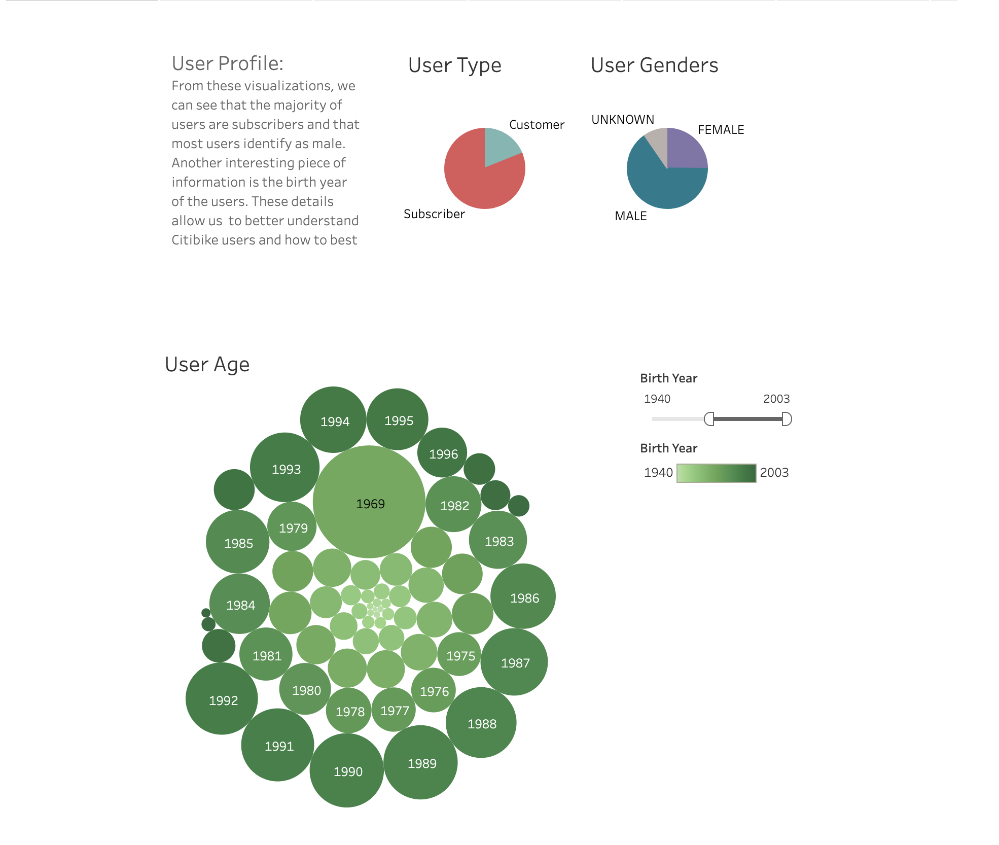
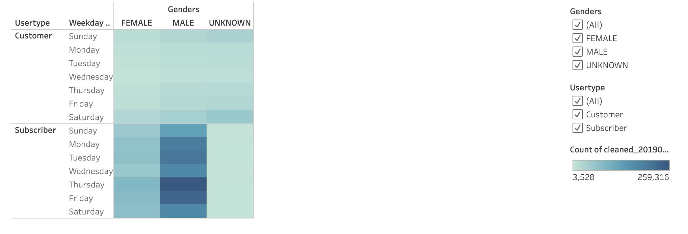
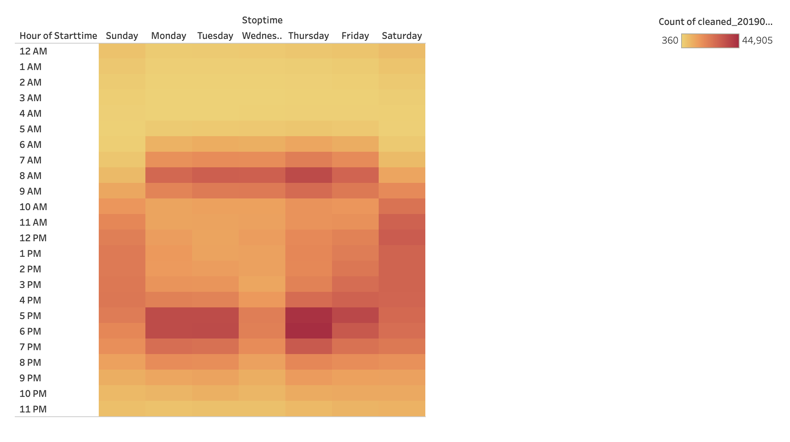
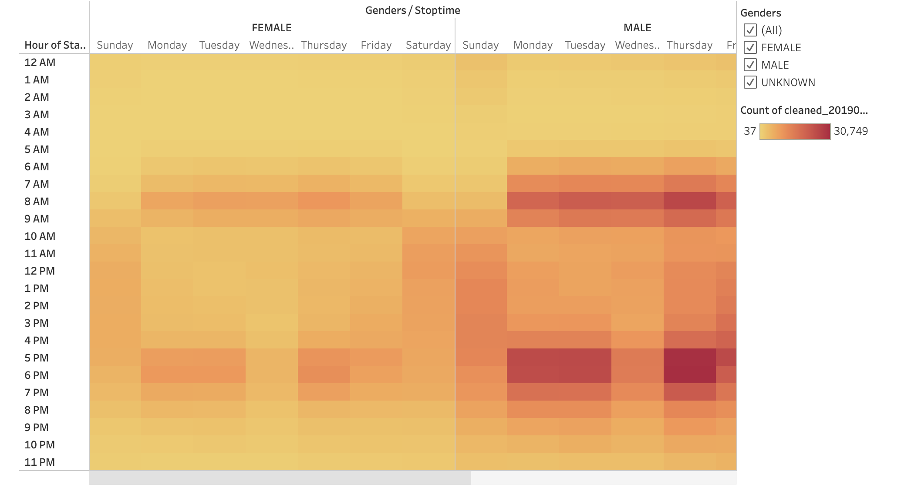
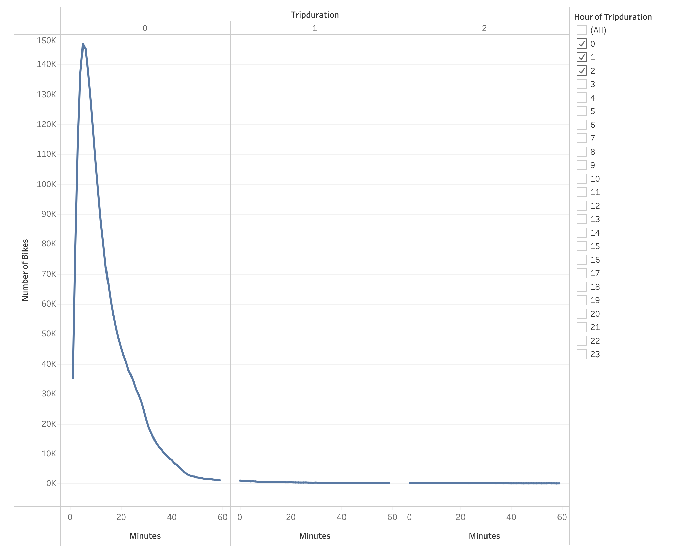
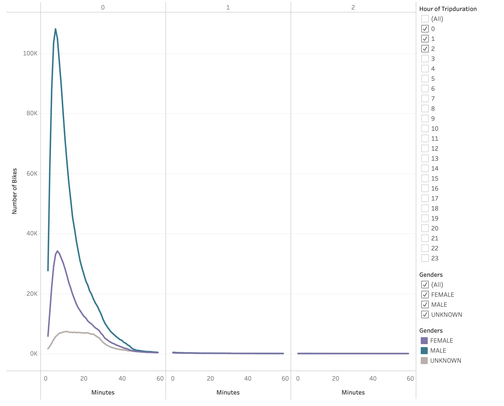
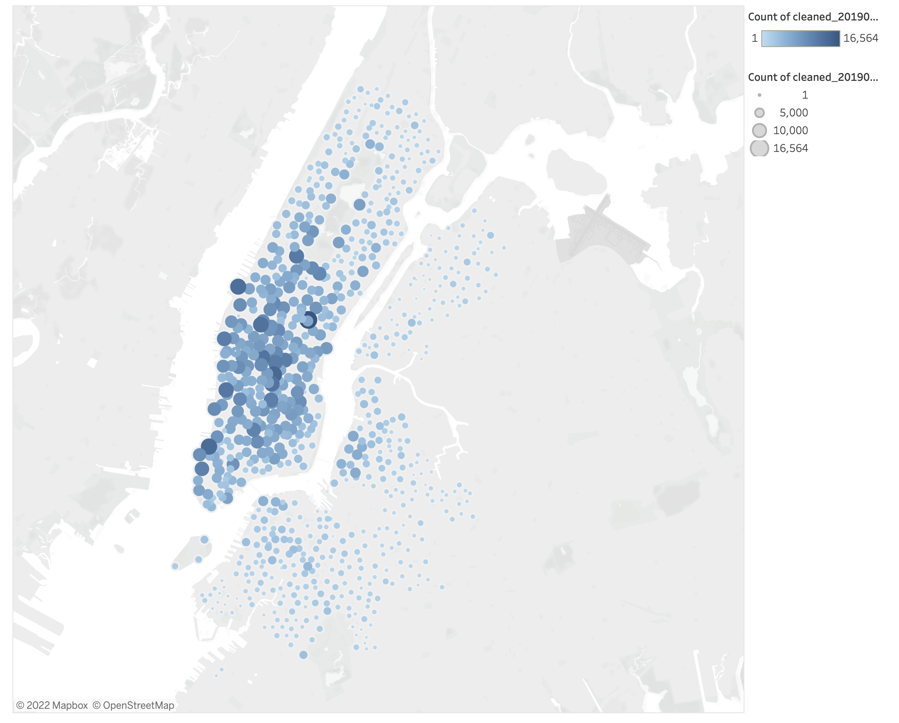
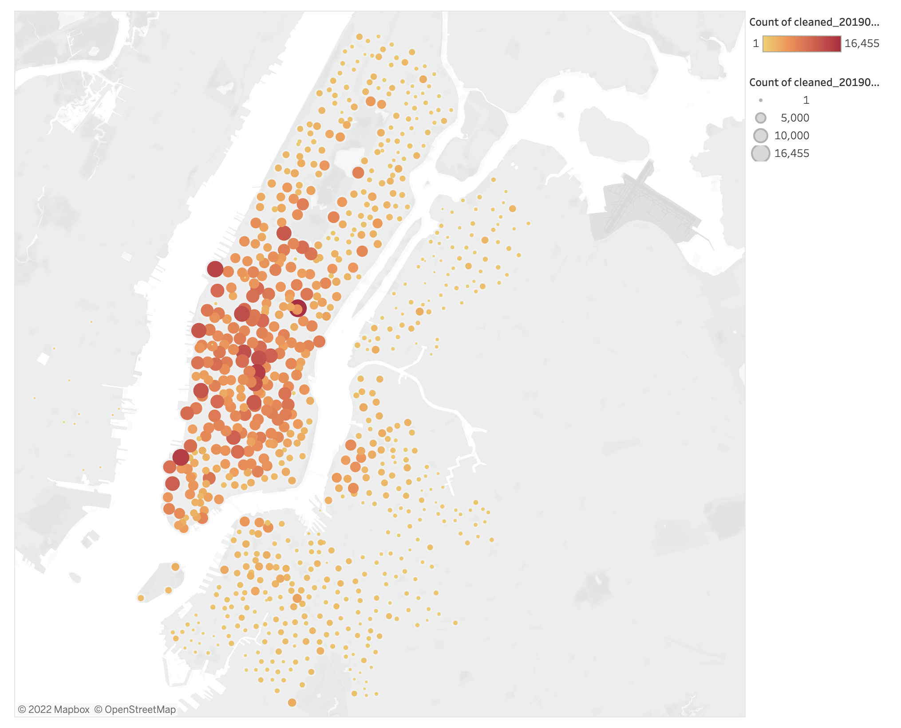

# bikesharing

## Overview - purpose
In New York, there is a successful bikesharing program - NYC Citi Bike Program. In this project, we analyzed data from the NYC bikesharing program to try and draw conclusions about the possible success of a ridesharing program in Des Moines, Iowa. In order to pitch a DM Citi Bike Program, our goal was to get to know the NYC users and bike preferences.

## Results - each visualization and description
[Click to see the complete Tableau Story of the visualizations!](https://public.tableau.com/app/profile/michal.michael/viz/Bikesharing_Challenge_16432219562030/Story1?publish=yes)

 

## Summary - summary of results and 2 more visualizations you would do 